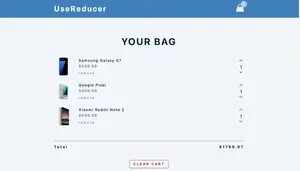

## Summary

Shopping cart with useReducer

[Live Demo](https://christy313.github.io/react15-project14/)



## Note

1. Set up functions in context

2. Pass props in related component as functions

3. Set up reducer 


## File structure

```
.
└── src
    ├── components
    │   ├── CartItem.js
    │   └── Navbar.js
    ├── container
    │   ├── App.js
    │   └── CartContainer.js
    ├── context.js
    ├── data.js
    ├── index.css
    ├── index.js
    └── reducer.js
```

## Available Scripts

In the project directory, you can run:

### `npm start`

Runs the app in the development mode.\
Open [http://localhost:3000](http://localhost:3000) to view it in your browser.
